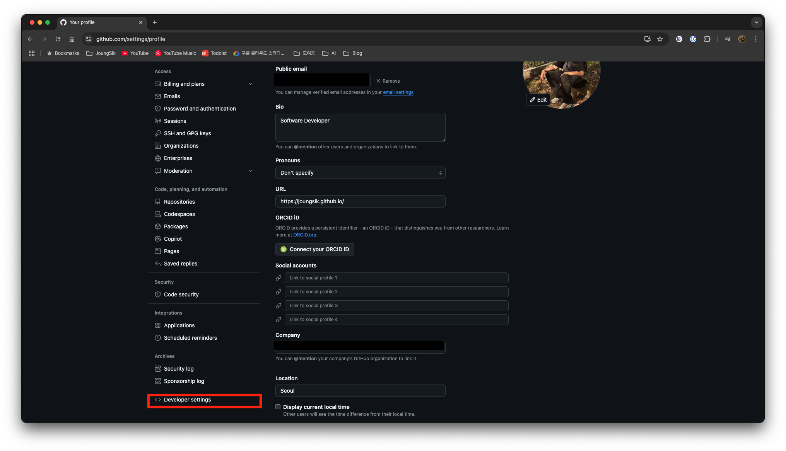
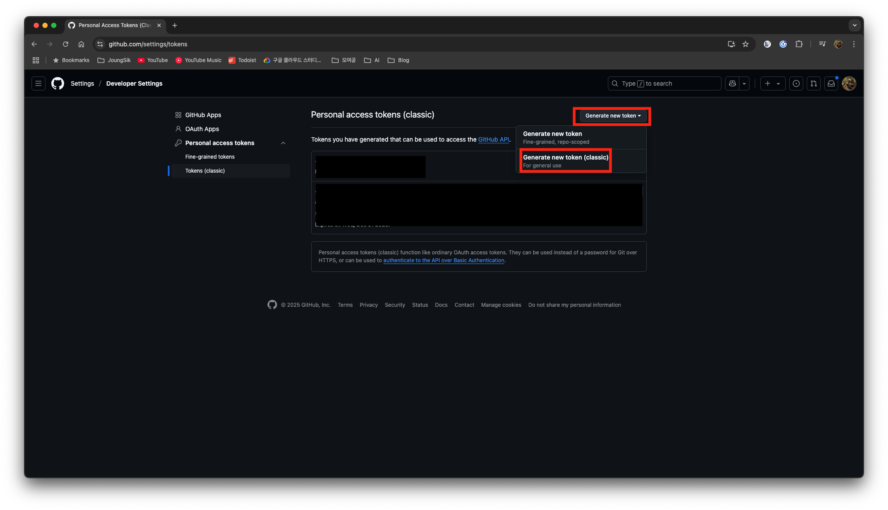
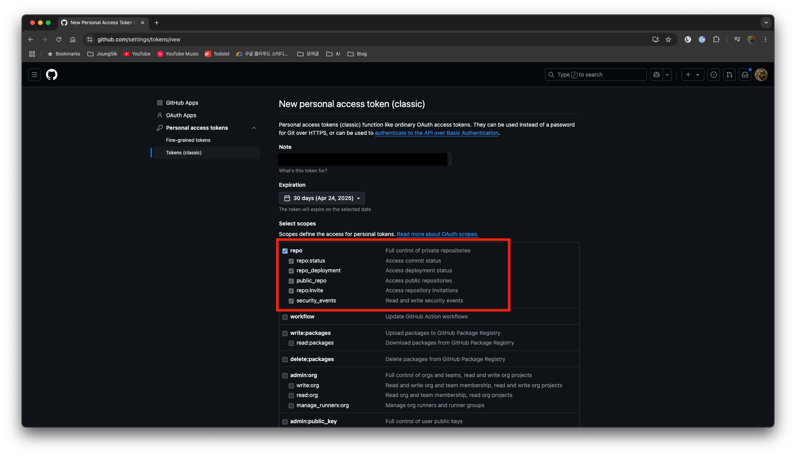
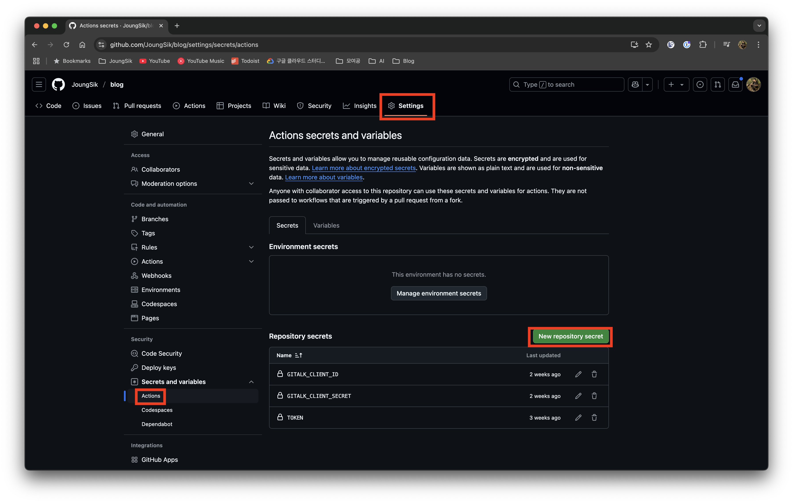
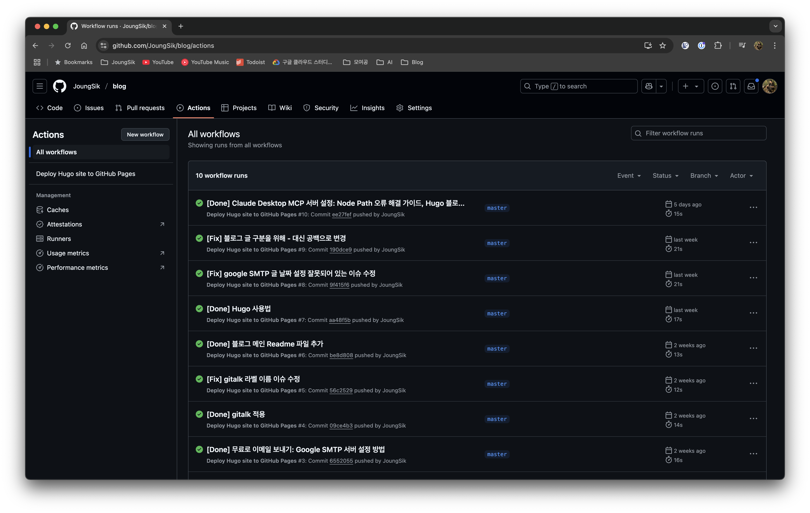
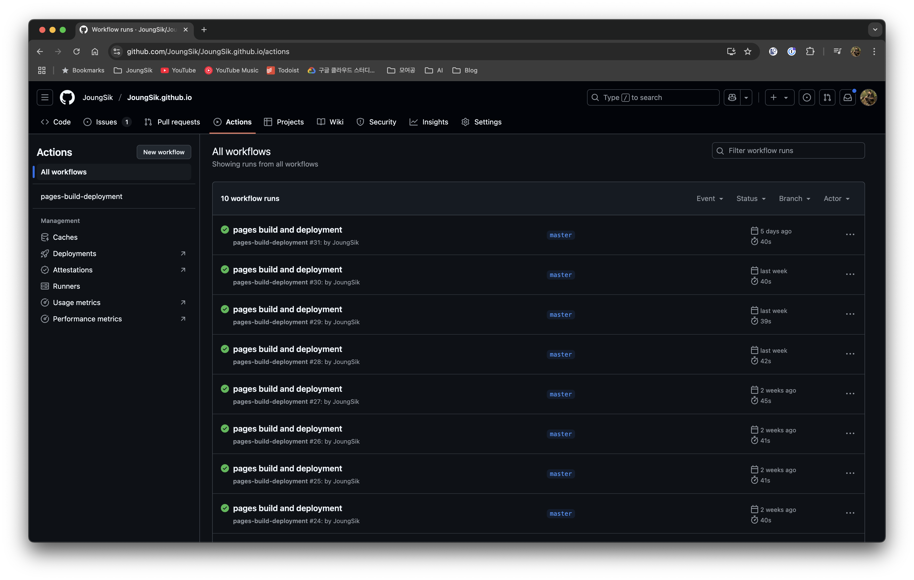
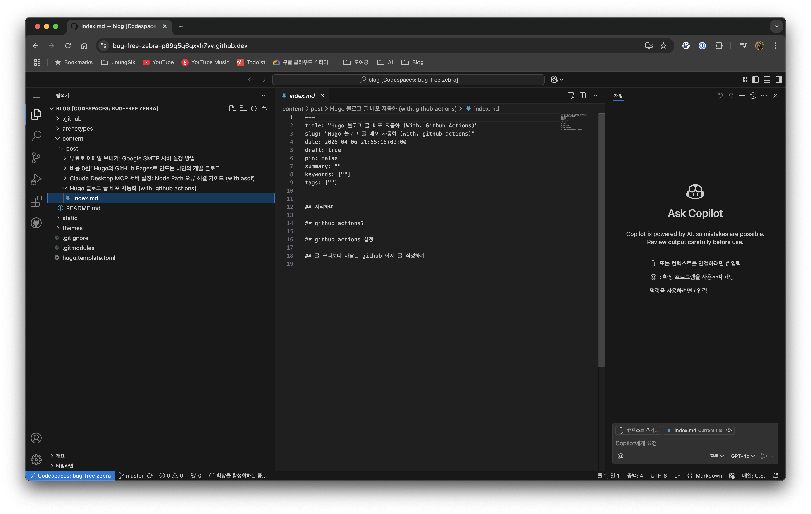

## 시작하며

[이전 글](https://joungsik.github.io/post/%EB%B9%84%EC%9A%A9-0%EC%9B%90-hugo%EC%99%80-github-pages%EB%A1%9C-%EB%A7%8C%EB%93%9C%EB%8A%94-%EB%82%98%EB%A7%8C%EC%9D%98-%EA%B0%9C%EB%B0%9C-%EB%B8%94%EB%A1%9C%EA%B7%B8/)에서 언급했듯이, 저는 GitHub Pages를 이용하여 블로그를 운영하고 있습니다.

이번 글에서는 이전 글에 이어 GitHub Actions를 활용한 블로그 배포 자동화 과정을 소개하려 합니다.

## GitHub Actions란?

[GitHub Actions](https://github.com/features/actions)는 GitHub 저장소에서 특정 이벤트(예: 코드 푸시)가 발생했을 때 자동으로 실행되는 일련의 작업들을 정의하는 도구입니다. 이러한 작업들은 CI/CD (Continuous Integration/Continuous Deployment) 파이프라인을 구축하는 데 사용될 수 있으며, 코드를 테스트하고, 빌드하고, 배포하는 등의 작업을 자동화할 수 있습니다.

GitHub Actions의 자세한 사용법은 [공식 문서](https://docs.github.com/ko/actions)를 참고하시는 것이 가장 좋습니다. 이 글에서는 제가 구축한 블로그에 적용한 자동화 방법에 대해 설명합니다.

## GitHub Actions 설정

먼저 블로그 프로젝트를 엽니다.

GitHub Actions 워크플로우는 프로젝트 내 `.github/workflows` 디렉터리에 있는 YAML 파일로 정의됩니다.

저는 `.github/workflows/deploy.yml` 파일을 생성하여 배포 설정을 관리하고 있습니다.

```yaml
name: Deploy Hugo site to GitHub Pages

on:
  push: # master 브랜치에 push될 때만 실행
    branches:
      - master

jobs:
  deploy:
    runs-on: ubuntu-latest
    steps:
      - name: Checkout blog repo # 현재 저장소의 코드 가져오기
        uses: actions/checkout@v3
        with:
          submodules: true
          fetch-depth: 0

      - name: Setup Hugo # Hugo 설치
        uses: peaceiris/actions-hugo@v2
        with:
          hugo-version: 'latest' # Hugo 최신 버전 사용 (안정적인 사용을 위해 특정 버전으로 지정하는 것을 권장)
          extended: true

      - name: Install envsubst # 환경 변수 치환 도구 설치
        run: sudo apt-get install gettext-base

      - name: Generate hugo.toml from template # 템플릿 파일로부터 hugo.toml 생성
        run: |
          export GITALK_CLIENT_ID="${{ secrets.GITALK_CLIENT_ID }}"
          export GITALK_CLIENT_SECRET="${{ secrets.GITALK_CLIENT_SECRET }}"
          envsubst < hugo.template.toml > hugo.toml

      - name: Build with Hugo # Hugo로 빌드
        run: hugo -t github-style

      - name: Checkout destination repo # 배포 대상 저장소 checkout
        uses: actions/checkout@v3
        with:
          repository: ${{ github.actor }}/${{ github.actor }}.github.io
          token: ${{ secrets.TOKEN }}
          path: .gh-pages

      - name: Copy files # 빌드 결과 복사 및 커밋
        run: |
          rm -rf .gh-pages/*
          cp -r public/* .gh-pages/
          cd .gh-pages
          git config user.name "${{ github.actor }}"
          git config user.email "Your Email"
          git add .
          git diff-index --quiet HEAD || git commit -m "${{ github.event.head_commit.message }}"
          git push
```

이렇게 설정하고 배포에 필요한 TOKEN 값을 설정합니다.

1. 설정에서 개발설정에 들어갑니다.

2. 토큰을 생성합니다.

3. repo 권한에 체크합니다.

4. 생성된 값을 블로그 repo의 설정에 추가합니다.


이후 글 작성 후 push가 되면 자동배포가 되는 것을 볼 수 있습니다.





## 글 쓰다보니 깨닫는 GitHub에서 글 작성하기

GitHub 저장소에서는 `,`를 누르면 Codespace가 열리면서 VS Code가 실행됩니다.

그러면 제가 로컬에서 작업하던 내용을 그대로 작성할 수 있게 됩니다.


