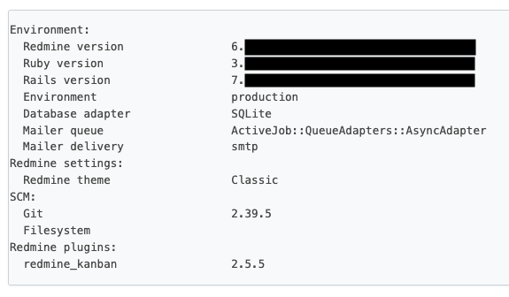

## 시작하며

이 글은 크게 2장으로 나눠서 Kamal 을 활용해 Redmine 서비스를 구축해본 경험에 대해서 설명할 예정입니다.

이번장에서는 그 중 Redmine 을 Docker 컨테이너로 만드는 과정에 대해서 상세히 설명합니다.

## Redmine

Redmine은 오픈소스 프로그램으로 웹 기반의 프로젝트 관리와 버그 추적 기능을 제공하는 도구입니다. 

저도 첫 회사 이후 접하는 건 처음이지만, 제가 가장 잘 사용하는 Ruby On Rails로 만들어진 프로그램이라 Kamal을 활용해보기 위해 선택하게 되었고, 별도로 projects라는 프로젝트 관리 서비스를 만들어 운영하고 있지만, 이미 만들어진 시스템을 분석해보는 것도 재미있겠다 싶어 시작했습니다.

Redmine은 SVN 을 통해 코드가 관리되고 있고 Github 에서는 이를 미러링 해서 사용하고 있습니다.

- [SVN](https://svn.redmine.org/redmine/)
- [GitHub](https://github.com/redmine/redmine)

또한 Redmine 으로 만들어진 [공식 홈페이지](https://www.redmine.org/)도 운영하고 있습니다.

여러 코드 관리 시스템을 지원하고 필요에 따라서는 Plugins 를 설치해 필요한 기능을 더 추가 할 수 도 있습니다.

지원 SCM (Source Control Management)
- Subversion
- Mercurial
- Cvs
- Bazaar
- Git

저는 이 중에서 Git 을 사용했습니다.

## Redmine 기본 설정

Redmine 을 사용하기 위해서는 기본적인 설정이 필요합니다.

해당 내용은 프로젝트 내의 [doc/INSTALL](https://github.com/JoungSik/redmine/blob/main/doc/INSTALL) 에 자세히 작성되어 있어 제가 설정한 내용만 공유 드립니다.

- Ruby 3.x
- SQLite3
- Google SMTP (설정 방법은 [이 글](https://joungsik.github.io/post/%EB%AC%B4%EB%A3%8C%EB%A1%9C-%EC%9D%B4%EB%A9%94%EC%9D%BC-%EB%B3%B4%EB%82%B4%EA%B8%B0-google-smtp-%EC%84%9C%EB%B2%84-%EC%84%A4%EC%A0%95-%EB%B0%A9%EB%B2%95/)을 참고하면 좋습니다.)
- secret_token 대신 Rails Credentials
- Rails HTTP/2 프록시 (thruster)
- bootsnap

## Redmine Dockerfile

[Docker Official Image](https://hub.docker.com/_/redmine) 도 있지만 저는 별도로 사용하기로 했습니다.

코드는 Rails8 프로젝트 생성 시 자동으로 생성되는 Dockerfile 을 기반으로 작성되었습니다.

```dockerfile
# syntax=docker/dockerfile:1
# check=error=true

# This Dockerfile is designed for production, not development. Use with Kamal or build'n'run by hand:
# docker build -t redmine .
# docker run -d -p 80:80 -e RAILS_MASTER_KEY=<value from config/master.key> --name redmine redmine

# For a containerized dev environment, see Dev Containers: https://guides.rubyonrails.org/getting_started_with_devcontainer.html

# Make sure RUBY_VERSION matches the Ruby version in .ruby-version
ARG RUBY_VERSION=3.4.1
FROM docker.io/library/ruby:$RUBY_VERSION-slim AS base

# Rails app lives here
WORKDIR /rails

# Install base packages
RUN apt-get update -qq && \
    apt-get install --no-install-recommends -y curl libjemalloc2 libvips sqlite3 git && \
    rm -rf /var/lib/apt/lists /var/cache/apt/archives

# Set production environment
ENV RAILS_ENV="production" \
    BUNDLE_DEPLOYMENT="1" \
    BUNDLE_PATH="/usr/local/bundle" \
    BUNDLE_WITHOUT="development"

# Throw-away build stage to reduce size of final image
FROM base AS build

# Install packages needed to build gems
RUN apt-get update -qq && \
    apt-get install --no-install-recommends -y build-essential git pkg-config && \
    rm -rf /var/lib/apt/lists /var/cache/apt/archives

# Install application gems
COPY Gemfile Gemfile.lock ./
COPY config/database.yml ./config/
RUN bundle install && \
    rm -rf ~/.bundle/ "${BUNDLE_PATH}"/ruby/*/cache "${BUNDLE_PATH}"/ruby/*/bundler/gems/*/.git && \
    bundle exec bootsnap precompile --gemfile

# Copy application code
COPY . .

# Precompile bootsnap code for faster boot times
RUN bundle exec bootsnap precompile app/ lib/

# Precompiling assets for production without requiring secret RAILS_MASTER_KEY
RUN SECRET_KEY_BASE_DUMMY=1 ./bin/rake assets:precompile


# Final stage for app image
FROM base

# Copy built artifacts: gems, application
COPY --from=build "${BUNDLE_PATH}" "${BUNDLE_PATH}"
COPY --from=build /rails /rails

# Run and own only the runtime files as a non-root user for security
RUN groupadd --system --gid 1000 rails && \
    useradd rails --uid 1000 --gid 1000 --create-home --shell /bin/bash && \
    mkdir -p storage files tmp/cache tmp/pids tmp/sockets tmp/imports tmp/thumbnails tmp/test data gitrepo && \
    chown -R rails:rails /rails "${BUNDLE_PATH}"
USER 1000:1000

# Entrypoint prepares the database.
ENTRYPOINT ["/rails/bin/docker-entrypoint"]

# Start server via Rails by default, this can be overwritten at runtime
EXPOSE 3000
CMD ["./bin/thrust", "./bin/rails", "server"]
```

## Redmine Docker Run

이렇게 빌드한 이미지를 실행시켜 보면서 이번 장을 마무리하겠습니다.

```shell
docker run -d -p 3000:3000 \
    -e RAILS_MASTER_KEY="$(cat config/master.key)" \
    -v /workspace/redmine_data:/data \
    -v /workspace/redmine_storage:/storage \
    -v /workspace/redmine_plugins:/rails/plugins \
    -v /workspace/redmine_repositories:/gitrepo \
    --name redmine redmine
```

## GitHub Actions는 안 쓰나요?

사용합니다.

다만, Kamal deploy 과정에서 GitHub Packages에 업로드하기 때문에 이번 글에서는 생략하겠습니다.

## 기타

저는 다음의 목적으로 [remine.joungsik.com](https://redmine.joungsik.com/projects)에서 사용하고 있습니다.

- GitHub Blog 글감 목록 및 블로그 개선 작업
- Redmine 관리에 필요한 작업 정리
- 읽을거리 모아두기

