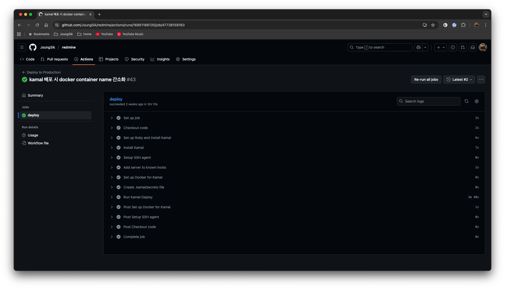
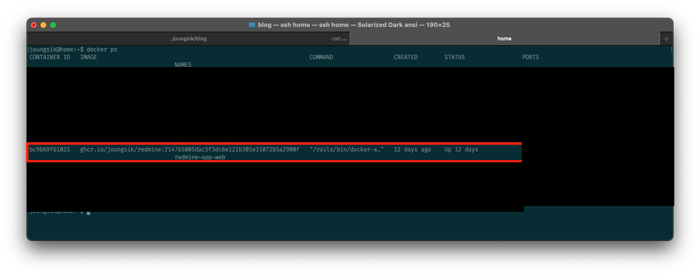

## 시작하며

이전 장에서는 Redmine을 Docker화 하는 과정을 이야기 했고 이번 장에서는 Docker화 한 이미지를 Kamal을 활용해 배포하는 내용에 대해서 작성하려고 합니다.

## Kamal

Kamal은 Docker를 활용해서 웹 앱을 배포하고 관리하는데 필요한 것들을 제공해주는 프로그램입니다.
제작자는 Rails 의 창시자라고 불리는 DHH (David Heinemeier Hansson) 가 이끄는 37signals 라는 조직에서 사용하고 있습니다.

Kamal이 만들어진 동기에는 AWS나 GCP와 같은 클라우드의 높은 비용과 Kubernetes의 복잡성에 의한 좌절감에서 만들어졌습니다.

Kamal은 기본적으로 Docker를 기반으로 동작하며 코드는 [여기](https://github.com/basecamp/kamal)에서 확인할 수 있습니다.

실제로 사용해봤을 때 여러 커스텀 적용을 하려다보니 새롭게 알게 되는 사실들이 많았습니다.

그리고 사용을 하다보니 Rails와 같은 웹 앱을 배포하는 것에 있어 Docker를 사용한다면 가볍게 사용하기에 Kamal만큼 좋은 것이 없다는 생각이 들 정도로 좋았습니다.

Kamal의 특징 중에는 또 무중단 배포가 제게는 가장 좋았던 부분인데 이를 알게 된 것은 배포 이후 container name을 고정하기 위해 옵션을 찾아보던 중에 알게 되었습니다.

우선 Kamal은 deploy 시 다음의 과정을 거치게 됩니다.

1. Dockerfile 기반의 Docker 이미지 빌드
2. 빌드된 Docker 이미지를 특정 registry로의 push
3. 원격지 서버에서 Docker 이미지 pull -> Docker 네트워크 생성 및 연결
4. 신규 Docker 컨테이너를 같은 네트워크의 같은 서비스 이름 실행 후 health 체크
5. 기존 Docker 컨테이너를 삭제

다음과 같은 무중단 방법을 진행하게 되어 Docker 이름 뒤에 붙은 태그 값으로 이전, 현재의 컨테이너를 찾고 있어 container name을 고정하는 것이 불가능했습니다.
Kamal 네트워크처럼 service 이름을 고정하는 것도 방법이지만 아직 추가 배포를 한 적이 없어 실행해보지는 않았습니다.

## Kamal Config

제가 배포에 사용했던 config 정보 입니다.

크게 2가지 버전으로 나뉩니다.

첫번째는 Redmine 단독으로 서비스를 운영하며 kamal-proxy를 활용해 SSL 인증을 받는 가장 기본적인 형태
```yaml
service: redmine
image: joungsik/redmine

servers:
  web:
    hosts:
      - <%= ENV.fetch("SSH_HOST") %>

registry:
  server: ghcr.io
  username: <%= ENV.fetch("REGISTRY_USER") %>
  password:
    - KAMAL_REGISTRY_PASSWORD

env:
  secret:
    - RAILS_MASTER_KEY

volumes:
  - /home/joungsik/workspace/redmine_data:/data
  - /home/joungsik/workspace/redmine_storage:/storage
  - /home/joungsik/workspace/redmine_plugins:/rails/plugins
  - /home/joungsik/workspace/redmine_repositories:/gitrepo

proxy:
  ssl: true
  host: redmine.joungsik.com

builder:
  arch: amd64

ssh:
  user: <%= ENV.fetch("SSH_USER") %>
```

두번째는 nginx-proxy-manager 를 활용해 하나의 물리적 서버에서 여러개의 서비스를 운영하는 형태
```yaml
service: redmine-app
image: joungsik/redmine

servers:
  web:
    hosts:
      - <%= ENV.fetch("SSH_HOST") %>
    proxy: false

registry:
  server: ghcr.io
  username: <%= ENV.fetch("REGISTRY_USER") %>
  password:
    - KAMAL_REGISTRY_PASSWORD

env:
  secret:
    - RAILS_MASTER_KEY

volumes:
  - /home/joungsik/redmine/data:/data
  - /home/joungsik/redmine/storage:/storage
  - /home/joungsik/redmine/plugins:/rails/plugins
  - /home/joungsik/redmine/repositories:/gitrepo

builder:
  arch: amd64

ssh:
  user: <%= ENV.fetch("SSH_USER") %>
```

차이점은 kamal-proxy를 사용하는가? nginx-proxy-manager를 사용하는가?에 대한 차이입니다.

다음은 공통적으로 들어가는 env 값에 대해서 이야기 하려고 합니다.

```.env
# 배포 하려는 서버의 IP 주소
SSH_HOST=
# 배포 하려는 서버의 접속 User
SSH_USER=

# docker image 를 올리기 위한 저장소 User
REGISTRY_USER=
# docker image 를 올리기 위한 저장소 Password
KAMAL_REGISTRY_PASSWORD=

# config 에는 나오진 않지만 SSH 접속을 위한 SSH Private Key
SSH_PRIVATE_KEY=
```

여기서 저는 Docker 이미지 저장소로 AWS의 ECR을 사용하지 않고 GitHub의 Packages를 사용했습니다. Kamal이 AWS와 같은 클라우드 서비스를 탈피하고자 하는 목적이 있는 것 같아 최대한 사용하지 않으려 했습니다.

따라서 GitHub Packages의 user, password 만드는 방법은 따로 검색 후 사용하시면 좋을 것 같습니다.

## GitHub Actions 

위 config 정보를 기반으로 GitHub Actions를 활용한 deploy.yml 코드입니다.

```yaml
name: Deploy to Production

on:
  push:
    branches: [ main ]
  workflow_dispatch:

jobs:
  deploy:
    runs-on: ubuntu-latest
    permissions:
      contents: read
      packages: write
    steps:
      - name: Checkout code
        uses: actions/checkout@v4

      - name: Set up Ruby and Install Kamal
        uses: ruby/setup-ruby@v1
        with:
          ruby-version: '3.4'
          bundler-cache: true
      - name: Install Kamal
        run: gem install kamal

      - name: Setup SSH agent
        uses: webfactory/ssh-agent@v0.9.0
        with:
          ssh-private-key: ${{ secrets.SSH_PRIVATE_KEY }}

      - name: Add server to known hosts
        run: |
          mkdir -p ~/.ssh
          ssh-keyscan -t rsa,dsa,ecdsa,ed25519 ${{ secrets.SSH_HOST }} > ~/.ssh/known_hosts
          chmod 600 ~/.ssh/known_hosts

      - name: Set up Docker for Kamal
        uses: docker/setup-buildx-action@v3

      - name: Create .kamal/secrets file
        run: |
          mkdir -p .kamal
          cat > .kamal/secrets << EOF
          KAMAL_REGISTRY_PASSWORD=${{ secrets.GITHUB_TOKEN }}
          RAILS_MASTER_KEY=${{ secrets.RAILS_MASTER_KEY }}
          EOF

      - name: Run Kamal Deploy
        env:
          REGISTRY_USER: ${{ github.actor }}
          KAMAL_REGISTRY_PASSWORD: ${{ secrets.GITHUB_TOKEN }}
          RAILS_MASTER_KEY: ${{ secrets.RAILS_MASTER_KEY }}
          SSH_HOST: ${{ secrets.SSH_HOST }}
          SSH_USER: ${{ secrets.SSH_USER }}
          KAMAL_VERSION: ${{ github.run_number }}
        run: |
          kamal deploy
```

저는 다음과 같은 형태로 사용하고 있습니다.
그러다보니 아래 5개의 secrets 값을 GitHub repo에 작성해서 사용하고 있습니다.

1. SSH_HOST
2. SSH_USER
3. SSH_PRIVATE_KEY
4. RAILS_MASTER_KEY
5. KAMAL_REGISTRY_PASSWORD

그러면 배포 액션이 돌고 자동으로 서버에도 배포가 되게 됩니다.




