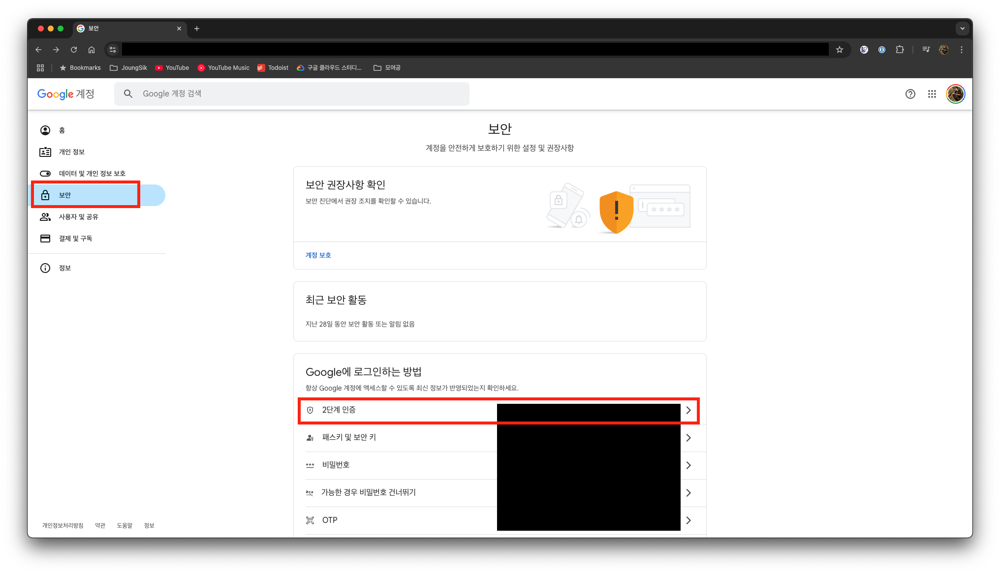
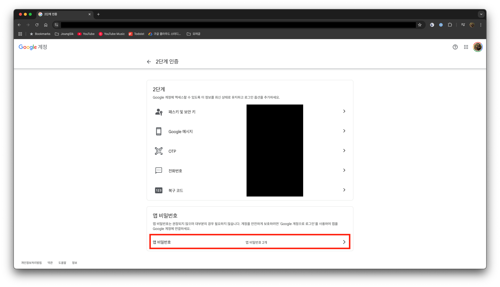
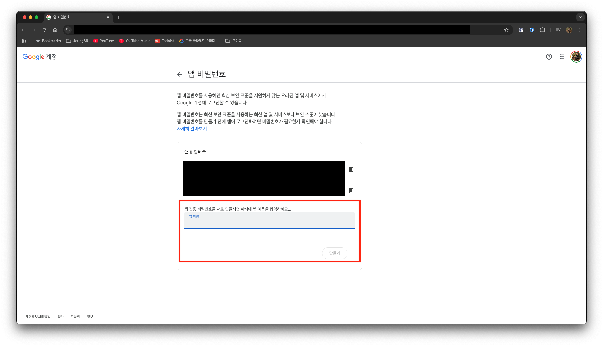
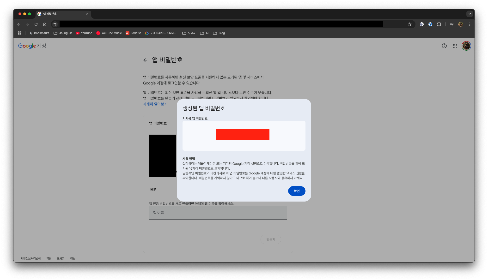
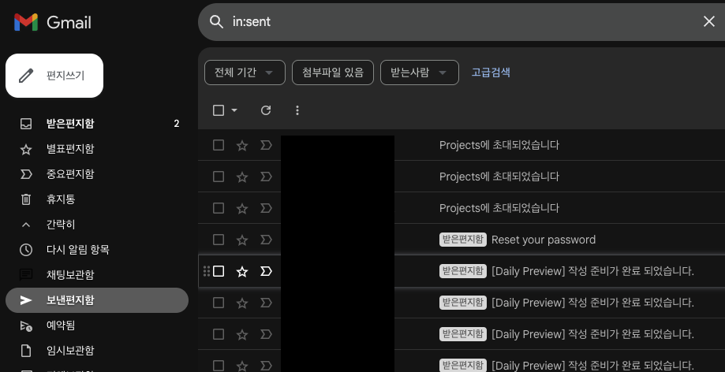

## 시작하며

사이드 프로젝트를 하다 보면 이메일 발송 기능이 필요할 때가 있습니다. 그런데 **구글 계정**만 있으면, 간단하게 이메일을 보낼 수 있습니다.

이 글에서는 Google SMTP 서버를 활용하여 무료로 이메일을 보내는 방법을 소개합니다.

## 구글 계정 정보 접속

먼저, 사용하고자 하는 구글 계정으로 로그인한 후 [계정 페이지](https://myaccount.google.com/)에 접속합니다.

왼쪽 메뉴에서 **보안** 페이지로 이동합니다.



### 2단계 인증 설정

보안 페이지에서 **2단계 인증**을 클릭합니다. 만약 2단계 인증이 설정되어 있지 않다면, 먼저 설정해야 할 수도 있습니다.

2단계 인증 페이지에 들어가면 하단에 **앱 비밀번호** 항목이 있습니다.



앱 비밀번호를 클릭하면, 앱 비밀번호를 생성할 수 있는 페이지로 이동합니다. 

**앱 이름**을 입력하고 **만들기** 버튼을 눌러 앱을 생성합니다. 저는 이미 생성한 앱들이 있어서 가려두었습니다.



그러면 새로 생성된 앱의 비밀번호가 노출되게 됩니다. 이 비밀번호는 유출되지 않도록 잘 보관합니다.

빨간색 영역으로 패스워드가 나타는 영역을 가려두었습니다.



## 웹 프레임워크 설정

저는 **Ruby On Rails**를 주로 사용하기 때문에 해당 프레임워크를 예로 들어 설명하겠습니다.

Rails에서는 서버의 설정에 따라 `development`, `test`, `production`과 같은 환경을 관리할 수 있습니다. 

여기서는 실제 메일을 사용할 것이기 때문에 **production** 환경에서 작업합니다.

`config/environments/production.rb` 파일을 열고, 다음 코드를 입력합니다:

```ruby
config.action_mailer.smtp_settings = {
    user_name: "google@gmail.com", # SMTP 설정 했던 이메일
    password: "qwer 1234 tyui 5678", # 앱 비밀번호
    address: "smtp.gmail.com",
    domain: "gmail.com",
    port: 587,
    authentication: :plain,
    enable_starttls_auto: true
}
```

이제 코드를 입력한 후 메일을 발송하면, 설정한 메일로 이메일이 발송됩니다.

> **주의:** 발송한 이메일이 종종 스팸함에 들어갈 수 있습니다. 
> 
> 이런 문제 때문에 메일 발송 서비스를 이용하는 것이 가장 좋지만 서비스 개발 초기에는 바로 서비스를 런칭하기 위해서 이 방법은 유용합니다.

발송 이력은 해당 구글 계정으로 **Gmail**에 접속해 **보낸 메시지**를 보면 확인할 수 있습니다.



이제 Google SMTP 서버를 활용하여 이메일을 보내는 방법으로 빠르게 서비스를 런칭할 수 있게 되었습니다.
