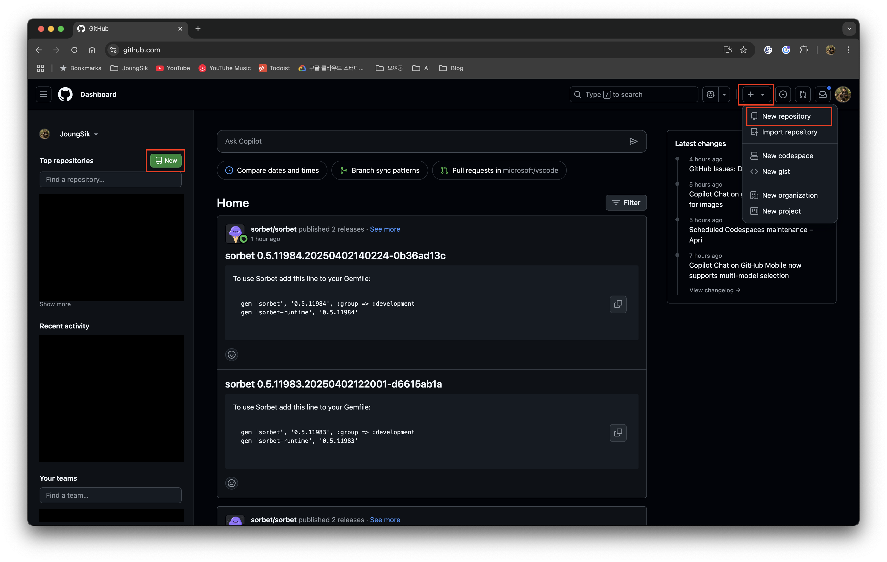
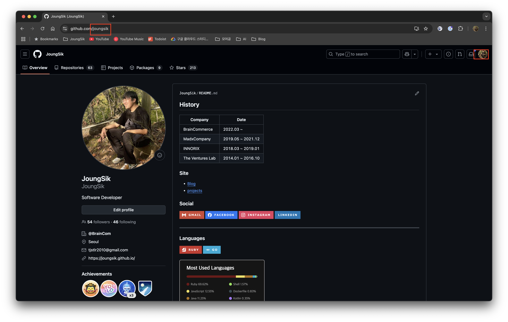
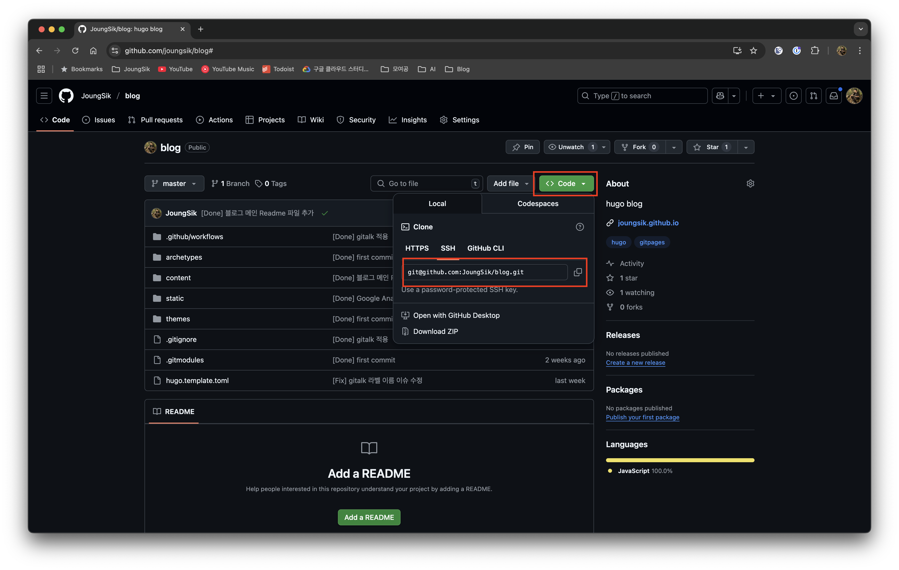

## 시작하며

지금 이 블로그는 GitHub의 GitHub Pages 기능을 활용하여 만든 정적 사이트 블로그입니다.

이 글에서는 블로그를 만드는 과정을 단계별로 정리했습니다.

## 준비물

GitHub Pages 기능을 활용하기 때문에 [GitHub 계정](https://github.com/)이 필요합니다.

GitHub 계정을 생성했다면, 코드를 저장할 저장소 2개가 필요합니다. GitHub에서는 이를 저장소(Repository, 줄여서 repo)라고 부릅니다.

GitHub 웹사이트에서 'New repository' 버튼을 통해 저장소를 생성합니다.



이때 생성할 저장소 2개의 이름은 각각 `blog`와 `{UserName}.github.io`로 합니다.

`blog` 저장소는 다른 이름으로 만들어도 괜찮습니다. 하지만 `{UserName}.github.io` 저장소는 GitHub Pages 기능을 사용하기 위해 반드시 이 형식을 따라야 합니다. `{UserName}` 부분에는 본인의 GitHub 사용자 이름을 넣어야 합니다.

예를 들어, 제 GitHub 사용자 이름은 `joungsik`이므로 저장소 이름은 `joungsik.github.io`가 됩니다.



마지막으로, 블로그 콘텐츠를 생성하고 관리하는 도구인 [Hugo](https://gohugo.io/)를 PC에 설치해야 합니다. 

Hugo는 Go 언어로 작성된 빠르고 유연한 **정적 사이트 생성기(Static Site Generator, SSG)** 입니다.

[Hugo 설치](https://gohugo.io/installation/) 에서 PC 에 맞게 설치 방법을 찾아 설치합니다.

## Hugo


[Hugo](https://github.com/gohugoio/hugo) 는 GoLang 으로 만들어진 오픈소스 입니다.

저는 주로 Ruby로 개발하지만, 병렬 처리나 성능 최적화가 필요한 부분에서는 GoLang을 활용합니다. GoLang의 매력에 빠져, GoLang 기반의 정적 사이트 생성기를 찾던 중 Hugo를 선택하게 되었습니다.

## 블로그 생성

Hugo는 다양한 명령어를 제공하지만, 이 글에서는 주로 사용하는 몇 가지 명령어 위주로 설명하겠습니다.


먼저 블로그 프로젝트를 생성합니다. 터미널에서 다음 명령어를 실행합니다.

```sh
hugo new site blog # 'blog'라는 이름의 새 Hugo 사이트 생성
```

이렇게 블로그 프로젝트를 생성합니다.

그러면 다음처럼 프로젝트가 생성된걸 볼 수 있습니다.

(참고: 저는 Markdown 미리보기가 편리한 [Visual Studio Code](https://code.visualstudio.com/)를 사용하여 블로그 글을 작성하고 있습니다.)


명령어를 실행하면 `blog` 디렉토리가 생성되고 그 안에 여러 파일과 디렉토리가 만들어집니다. 오늘은 이 중에서 콘텐츠가 저장될 `content`, 설정 파일인 `hugo.toml` 를 주로 다룰 것입니다.

다른 디렉토리는 추후 필요할 때 설명하겠습니다.

여기까지 진행했다면, 생성된 블로그 프로젝트를 앞서 만든 `blog` GitHub 저장소에 업로드합니다.

먼저, `blog` 디렉토리로 이동하여 Git 저장소를 초기화하고, 지금까지의 작업 내용을 로컬 Git 저장소에 커밋합니다.

```sh
cd blog
git init # 현재 디렉토리를 Git 저장소로 초기화
git add ./
git commit -m "first commit"
```

GitHub 의 blog 프로젝트, 즉 remote git 에 로컬 git 을 연결합니다.

원격 저장소 주소는 해당 GitHub 저장소 페이지에서 확인할 수 있습니다.

아래 이미지는 제 GitHub 입니다.



HTTPS 주소도 사용할 수 있지만, 저는 주로 SSH 주소를 사용합니다. GitHub에 SSH 키를 등록해두면 비밀번호 입력 없이 편리하게 작업할 수 있습니다.

```sh
git remote add origin git@github.com:{UserName}/blog.git # SSH 방식 {UserName}을 본인 계정으로 변경 

git remote -v # 등록된 remote git 확인 => origin 에 주소가 있다면 OK
```

이제 로컬 커밋을 원격 저장소로 푸시(push)합니다.

```sh
git push origin main
```

이제 `blog` GitHub 저장소에 접속하면 `first commit` 코드가 성공적으로 업로드된 것을 확인할 수 있습니다.

## 블로그 글 작성

다음은 블로그 글 작성하는 방법입니다.

Hugo는 Markdown으로 작성된 콘텐츠를 HTML 파일로 변환해주는 도구입니다.

따라서 우리는 Markdown 문법을 사용하여 블로그 글을 작성하면 됩니다.

새 글 파일은 다음 명령어로 생성합니다.

```sh
hugo new content/post/블로그-제목.md
```

그러면 `content/post` 디렉토리 아래에 `블로그-제목.md` 파일이 생성되게 됩니다.
기본적으로 `content/posts` 디렉토리에 생성되지만, `archetypes/default.md` 파일을 수정하거나 테마 설정에 따라 경로가 달라질 수 있습니다. 여기서는 `content/post`를 기준으로 설명합니다. (만약 `content/post` 디렉토리가 없다면 직접 생성해주세요.)

생성된 파일을 열어보면, 상단에 'front matter'라고 불리는 YAML, TOML, 또는 JSON 형식의 설정 정보가 포함된 것을 볼 수 있습니다.

이 front matter는 `hugo new` 명령 실행 시 자동으로 추가되며, 각 글의 제목, 작성일, 초안(draft) 상태 등을 정의합니다. `archetypes/default.md` 파일을 수정하여 기본 front matter 내용을 변경할 수도 있습니다.

기본 생성 내용은 다음과 같습니다. (`hugo.toml` 설정에 따라 형식이 다를 수 있습니다.)

```markdown
---
title = '{{ replace .File.ContentBaseName `-` ` ` | title }}'
date: {{ .Date }}
draft: true
---
```
기본값은 다음과 같습니다:
*   `title`: 파일 이름에서 하이픈(-)을 공백으로 바꾼 후 각 단어의 첫 글자를 대문자로 변환한 값 (예: `블로그 제목`)
*   `date`: 파일 생성 시각 (ISO 8601 형식)
*   `draft`: `true` (초안 상태). `true`이면 실제 블로그에는 발행되지 않습니다. 발행하려면 `false`로 변경하거나 이 줄을 삭제합니다.

이처럼 Go 템플릿 문법을 활용하여 동적으로 front matter 값을 설정할 수 있습니다.

front matter 아래에 Markdown 문법으로 자유롭게 글의 본문을 작성하면 됩니다.

작성 중인 글이 실제 블로그에 어떻게 보일지 확인하고 싶다면, 다음 명령어를 사용하여 로컬 개발 서버를 실행합니다.

```sh
hugo server -D # -D 옵션은 draft: true 인 글도 보이게 함
```

그러면 웹 브라우저에서 `http://localhost:1313/` 주소로 접속하여 실시간으로 변경 사항을 확인하며 글을 작성할 수 있습니다. 파일을 저장하면 자동으로 브라우저가 새로고침되어 편리합니다. (Live Reloading)

## 블로그 테마 선택

모든 블로그에는 디자인을 담당하는 테마(Theme)가 필요하며, Hugo 역시 다양한 테마를 지원합니다.

Hugo 공식 웹사이트의 [테마 목록](https://themes.gohugo.io/)에서 원하는 테마를 선택하여 사용할 수 있습니다.

저는 GitHub 을 좋아해서 마침 있던 [GitHub Style](https://themes.gohugo.io/themes/github-style/) 을 사용하고 있습니다.

## 블로그 테마 적용

여기서는 제가 사용하는 GitHub Style 테마를 기준으로 적용 방법을 설명합니다. 다른 테마도 유사한 방식으로 적용할 수 있습니다.

마음에 드는 테마를 선택했다면, 다음 단계에 따라 블로그에 적용합니다.

Hugo는 일반적으로 Git의 `submodule` 기능을 이용하여 테마를 관리합니다. 이를 통해 테마 코드를 내 프로젝트와 분리하여 관리하고 업데이트하기 용이합니다.

대부분의 테마는 공식 문서나 GitHub 저장소 README에 설치 및 설정 방법이 안내되어 있으므로, 해당 문서를 참고하는 것이 가장 좋습니다.

```sh
git submodule add git@github.com:MeiK2333/github-style.git themes/github-style # themes 디렉토리에 테마 설치

# cd themes/github-style # 테마 디렉토리로 이동 (필요시)
# git pull origin master # submodule 로 관리하는 테마의 최신 코드를 가져오기 (필요시)
```
`git submodule add` 명령어를 실행하면 `themes` 디렉토리 아래에 해당 테마의 코드가 다운로드되고, 프로젝트 루트에 `.gitmodules` 파일이 생성되어 submodule 정보가 기록됩니다.

GitHub Style 테마의 경우, Hugo의 기본 콘텐츠 디렉토리인 `content/posts` 대신 `content/post`를 사용합니다. 따라서 기존에 `content/posts` 디렉토리가 있다면 `content/post`로 이름을 변경해야 합니다. (만약 `hugo new site blog` 명령어로 처음 생성했다면 `content` 디렉토리만 존재하므로 이 단계는 생략해도 됩니다.)

```sh
mv content/posts content/post
```

테마를 적용합니다.
테마를 설정 파일(`hugo.toml`)에 지정하거나, 빌드 및 서버 실행 시 `-t` 또는 `--theme` 옵션으로 테마를 명시하여 적용합니다.

**1. 설정 파일에 테마 지정 (권장):**
`hugo.toml` 파일에 다음 줄을 추가합니다.
```toml
theme = "github-style"
```
이렇게 설정하면 `hugo` 또는 `hugo server` 명령어 실행 시 자동으로 해당 테마가 적용됩니다.

**2. 명령어 옵션으로 테마 지정:**
```sh
hugo -t github-style # 빌드 시 테마 지정
hugo server -t github-style # 로컬 서버 실행 시 테마 지정 (-D 옵션과 함께 사용 가능)
```

## 블로그 설정파일

`hugo new site` 명령으로 프로젝트를 생성하면 `hugo.toml` 파일(또는 설정에 따라 `hugo.yaml`, `hugo.json`)이 생성되며 기본적인 설정이 포함되어 있습니다.

```toml
baseURL = 'https://example.org/'
languageCode = 'en-us'
title = 'My New Hugo Site'
```

*   `baseURL`: 블로그가 최종적으로 배포될 주소입니다. GitHub Pages를 사용하므로 `https://{UserName}.github.io/`로 수정합니다. (`{UserName}`은 본인 계정으로 변경)
*   `languageCode`: 블로그의 기본 언어 설정입니다. 한국어 블로그라면 `ko-kr` 등으로 설정할 수 있습니다.
*   `title`: 블로그 제목이므로 원하는 이름으로 변경합니다.
*   `theme`: (앞서 설명) 사용할 테마의 이름을 지정합니다. 예: `"github-style"`

기본 설정 외에 테마별로 추가 설정이 필요한 경우가 많습니다. 예를 들어 메뉴 구성, 저작권 표시, 소셜 링크 등을 설정 파일에 추가해야 할 수 있습니다. 이는 테마 문서에서 요구하는 설정을 `hugo.toml` 파일에 추가해야 합니다. `params` 섹션 등을 활용하게 됩니다.

## 블로그 배포

블로그 글 작성을 완료하고 `blog` 저장소에 변경 사항을 반영(커밋 및 푸시)했다면, 이제 실제 사용자들이 접속할 수 있도록 `{UserName}.github.io` 저장소에 빌드된 결과물을 배포해야 합니다.

`hugo` 명령어를 실행하여 로컬에서 블로그를 빌드하면 `/public` 디렉토리가 생성됩니다. (기본 설정이며, `publishDir` 설정으로 빌드 결과물 경로를 변경할 수 있습니다.) 이 디렉토리에는 웹사이트를 구성하는 모든 정적 파일(HTML, CSS, JS, 이미지 등)이 담겨 있습니다.

이 `/public` 디렉토리의 **내용 전체**를 미리 만들어둔 `{UserName}.github.io` 저장소의 루트(root)에 업로드(커밋 및 푸시)하면 배포가 완료됩니다. `{UserName}.github.io` 저장소의 `main` (또는 `master`) 브랜치에 푸시된 내용이 GitHub Pages를 통해 웹사이트로 발행됩니다.

배포 과정을 조금 더 간편하게 하려면, `blog` 프로젝트 내의 `/public` 디렉토리를 `{UserName}.github.io` 저장소의 `submodule`로 연결하는 방법도 있습니다. 이렇게 하면 `hugo` 명령으로 빌드한 후 `/public` 디렉토리에서 바로 커밋하고 푸시하여 배포할 수 있습니다.

더 나아가, `blog` 저장소에 새로운 커밋이 푸시될 때마다 자동으로 빌드 및 배포 과정을 수행하도록 GitHub Actions 워크플로우를 설정할 수도 있습니다. 이 자동 배포 설정 방법은 다음 글에서 자세히 다루겠습니다.

## 마무리

지금까지 Hugo와 GitHub Pages를 이용해 무료로 나만의 개발 블로그를 만드는 기본적인 과정을 살펴보았습니다. 다음 글에서는 Google Analytics 연동 방법과 GitHub Actions를 이용한 자동 배포 설정에 대해 다룰 예정입니다.

그 외에도 [Hugo 공식 문서](https://gohugo.io/documentation/)에는 다양한 기능과 활용법이 소개되어 있습니다. 문서를 참고하여 유용한 기능들을 적용해보고 관련 내용을 공유하도록 하겠습니다.

## 참조

아래는 참고할 만한 Hugo 공식 문서 링크입니다.

[다른 CMS 툴에서 Hugo 로 마이그레이션 하기](https://gohugo.io/tools/migrations/)

[Hugo 에 모듈 만들어서 붙이기](https://gohugo.io/hugo-modules/)
